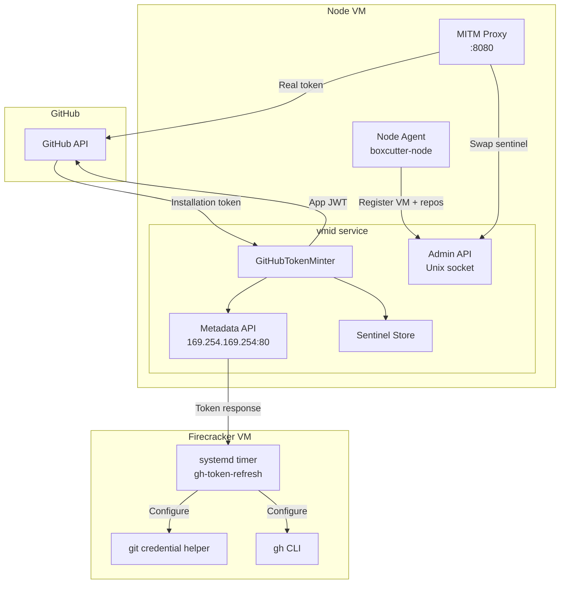
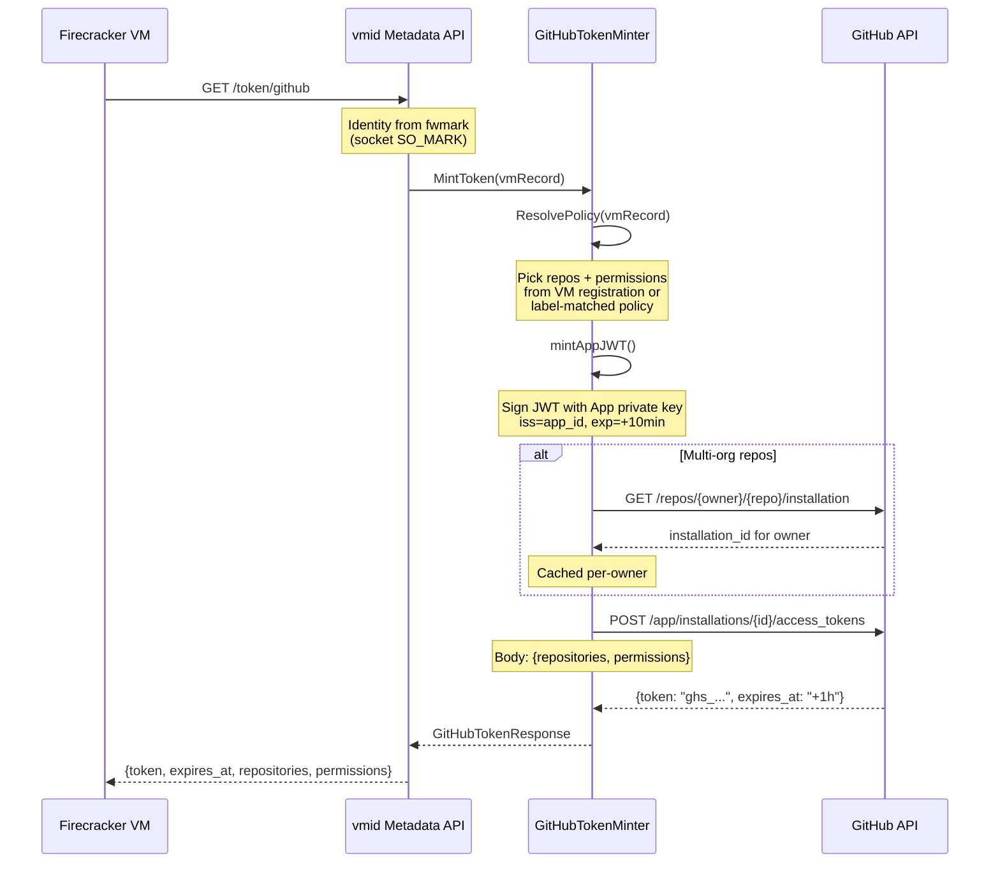
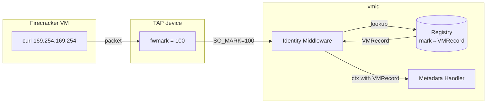
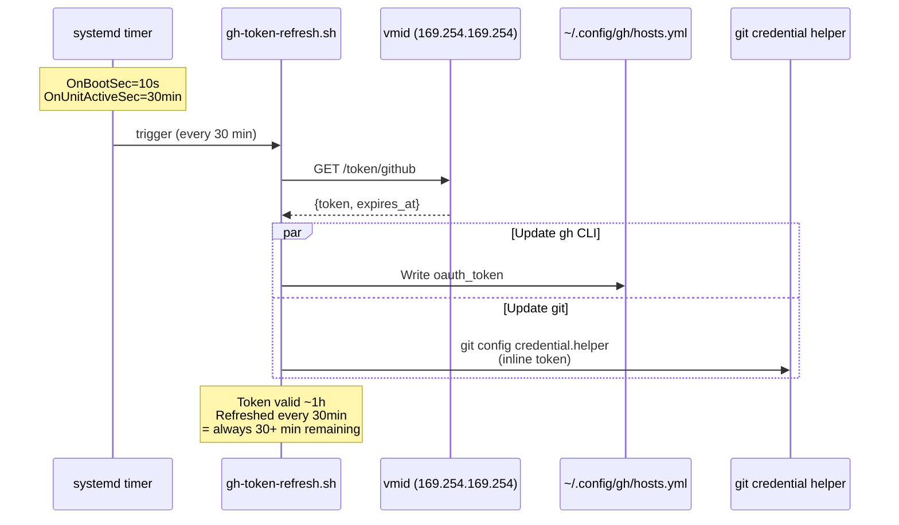
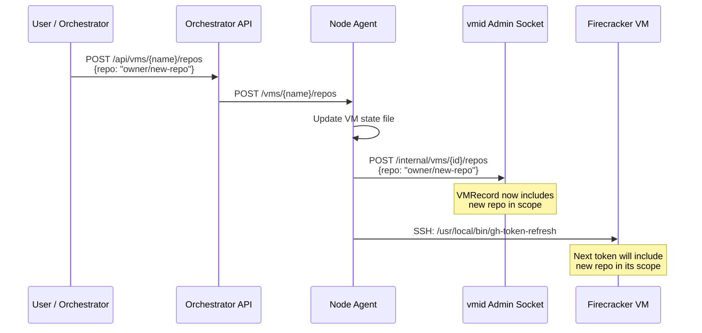
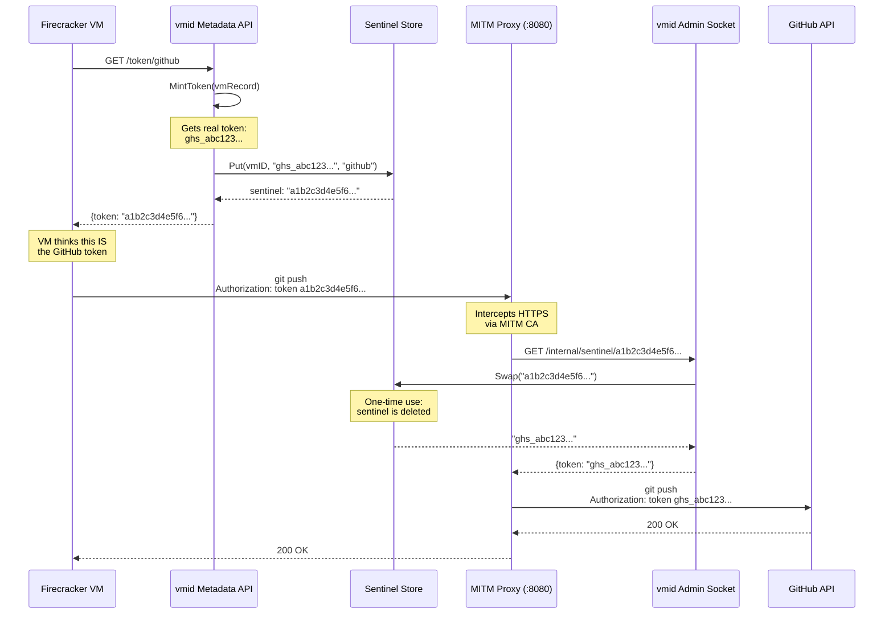

# GitHub Token Lifecycle

How GitHub App installation tokens are minted, distributed to VMs, refreshed on
a timer, and — in paranoid mode — never exposed to guest environments at all.

## Overview

Boxcutter uses a **GitHub App** to create short-lived, scoped installation
tokens for each Firecracker/QEMU VM. No long-lived PATs are stored anywhere in
the system. The token lifecycle has five phases:

1. **Configuration** — GitHub App credentials are deployed to each node
2. **Minting** — The `vmid` service creates scoped installation tokens on demand
3. **Distribution** — Tokens reach VMs via a metadata service (like cloud IMDS)
4. **Consumption** — `git` and `gh` CLI use the token transparently
5. **Refresh** — A systemd timer re-fetches tokens every 30 minutes



---

## Phase 1: Configuration

The GitHub App private key and IDs are configured in `/etc/boxcutter/boxcutter.yaml`,
which is distributed to every node as part of the immutable node image:

```yaml
github:
  enabled: true
  app_id: 123456
  installation_id: 789012
  private_key_path: /etc/boxcutter/secrets/github-app.pem
```

The `vmid` service reads this on startup and initializes a `GitHubTokenMinter`
(`node/vmid/internal/token/github.go`). If `github.enabled` is `false` or the
section is absent, GitHub token endpoints return 404.

### Policy-based scoping (optional)

For label-matched VMs (non-dev workloads), policies control which repos and
permissions a token gets:

```yaml
policies:
  - match:
      labels:
        role: ci
    github:
      repositories:
        - "myorg/*"          # glob patterns resolved against App installation
      permissions:
        contents: read
        packages: write
```

---

## Phase 2: Minting

Token minting is a three-step exchange with GitHub's API. Every token is
**minted fresh on each request** — there is no token cache.



### Step 2a: Policy resolution

`ResolvePolicy()` determines what scope the token should have:

| Priority | Source | When |
|----------|--------|------|
| 1 | VM registration (`github_repos` field) | Dev VMs created with explicit repos |
| 2 | Label-matched policy from config | CI/automation VMs matching policy labels |

Dev VMs get broad write permissions:
```go
// contents:write, pull_requests:write, issues:write,
// metadata:read, packages:write, workflows:write
```

### Step 2b: App JWT

A short-lived JWT (10-minute expiry, 60-second backdated `iat` for clock skew)
signed with the App's RSA private key using RS256:

```go
claims := jwt.MapClaims{
    "iat": now.Add(-60 * time.Second).Unix(),
    "exp": now.Add(10 * time.Minute).Unix(),
    "iss": g.appID,
}
```

### Step 2c: Installation lookup

If the requested repos span multiple GitHub App installations (multi-org), the
minter looks up the correct `installation_id` per owner via
`GET /repos/{owner}/{repo}/installation`. Results are cached by owner in
`installationCache`.

### Step 2d: Installation token creation

The App JWT is exchanged for a scoped installation token via
`POST /app/installations/{id}/access_tokens`. The request body specifies
exactly which repositories and permissions:

```json
{
  "repositories": ["repo-name"],
  "permissions": {"contents": "write", "pull_requests": "write"}
}
```

GitHub returns a token (`ghs_...`) valid for **1 hour**.

### Repo glob resolution

When policies use glob patterns like `myorg/*`, the minter fetches the full
list of repos accessible to the installation, caches it (default 15-minute TTL),
and matches against the patterns using `filepath.Match`.

---

## Phase 3: Distribution

### VM identity via fwmark

Each Firecracker VM gets a unique Linux **fwmark** on its TAP device. When a VM
makes an HTTP request to `169.254.169.254`, the `vmid` metadata service reads
the `SO_MARK` value from the TCP socket to identify which VM is calling —
no authentication headers needed.



The identity middleware (`node/vmid/internal/middleware/identity.go`) extracts
the mark and attaches the `VMRecord` to the request context. The metadata
handler then uses the record to mint a correctly-scoped token.

### VM registration

When the node agent creates a VM, it registers it with `vmid` via the admin
Unix socket (`/run/vmid/admin.sock`):

```go
m.vmid.Register(&vmid.RegisterRequest{
    VMID:        st.Name,
    VMType:      "firecracker",
    IP:          "10.0.0.2",
    Mark:        st.Mark,
    Mode:        st.Mode,           // "normal" or "paranoid"
    GitHubRepo:  st.GitHubRepo,
    GitHubRepos: st.AllGitHubRepos(),
})
```

This registration tells `vmid` which repos to include in tokens minted for
this VM.

### Initial token injection

During VM creation, the node agent SSHs into the VM and sets up both the `gh`
CLI and `git` credential helper with an initial token:

```bash
# gh CLI config
mkdir -p ~/.config/gh
cat > ~/.config/gh/hosts.yml <<EOF
github.com:
    oauth_token: <initial-token>
    user: x-access-token
    git_protocol: https
EOF

# git credential helper — dynamically fetches from metadata service
git config --global credential.helper \
  '!f() { token=$(curl -sf http://169.254.169.254/token/github | ...); \
   echo username=x-access-token; echo password=$token; }; f'
```

The credential helper has a **fallback**: if the metadata service is
unreachable, it uses the initial token that was baked in at setup time.

### Initial repo clone

Repos are cloned using a token-authenticated URL, then the token is stripped
from the remote:

```bash
git clone https://x-access-token:<token>@github.com/owner/repo.git ~/project
git remote set-url origin https://github.com/owner/repo.git
```

After this, all subsequent `git fetch`/`push` operations go through the
credential helper, which fetches a fresh token from the metadata service.

---

## Phase 4: Consumption

Inside the VM, two tools consume GitHub tokens:

| Tool | Token source | File |
|------|-------------|------|
| `git` (HTTPS) | Credential helper → `curl 169.254.169.254/token/github` | `~/.gitconfig` |
| `gh` CLI | `~/.config/gh/hosts.yml` | Written by refresh script |

The credential helper is **dynamic** — every `git push`/`fetch` triggers a
fresh metadata call, so git always has a valid token even if the cached one in
`hosts.yml` has expired.

---

## Phase 5: Refresh

A systemd timer inside each VM ensures tokens stay fresh:



### Timer configuration

```ini
# gh-token-refresh.timer
[Timer]
OnBootSec=10s           # First run 10s after boot
OnUnitActiveSec=30min   # Then every 30 minutes
AccuracySec=1min        # Allow 1-minute jitter
```

### Refresh script (`/usr/local/bin/gh-token-refresh`)

The script:
1. Fetches a fresh token from `http://169.254.169.254/token/github`
2. Writes `~/.config/gh/hosts.yml` for the `gh` CLI
3. Updates the git credential helper with the new token inline
4. Logs the expiry time for debugging

If the metadata service isn't configured (no GitHub App), the script exits
cleanly without error.

### Event-driven refresh

Beyond the timer, tokens are also refreshed **on demand** when repos change:



When a repo is added via the orchestrator API:
1. The orchestrator forwards to the node agent
2. The node agent updates the VM state and `vmid` registration
3. The node agent SSHs into the VM and runs `gh-token-refresh`
4. The refresh script fetches a new token — now scoped to include the new repo

---

## Paranoid Mode

In paranoid mode, **real tokens never enter the VM**. Instead, the VM receives
a **sentinel token** — a random 64-character hex string that is meaningless on
its own. The MITM proxy swaps it for the real credential at the network edge.



### How it works

1. **Token wrapping**: When `vmRecord.Mode == "paranoid"`, the metadata handler
   wraps the real token in a sentinel before returning it to the VM
   (`node/vmid/internal/api/metadata.go:111-118`)

2. **Sentinel store**: An in-memory map of `sentinel → {vmID, realToken, kind}`.
   Sentinels are cryptographically random (32 bytes / 64 hex chars).
   (`node/vmid/internal/sentinel/store.go`)

3. **One-time swap**: `Swap()` returns the real token and **deletes the sentinel**.
   This means each sentinel can only be used once — subsequent requests with the
   same sentinel get a 404.

4. **Proxy interception**: The MITM proxy (`node/proxy/cmd/proxy/main.go`)
   intercepts all HTTPS traffic, scans the `Authorization` header, and calls
   the vmid admin socket to swap any sentinel it finds.

5. **Egress allowlist**: In paranoid mode, the proxy also enforces a domain
   allowlist (`/etc/boxcutter/proxy-allowlist.conf`). Requests to unlisted
   domains are blocked with 403.

6. **Cleanup**: When a VM is deregistered, `PurgeVM()` removes all its sentinels.

### Network enforcement

Paranoid mode VMs have iptables rules that:
- **Block** direct internet access
- **Allow** traffic only through the proxy on `:8080`
- The VM's `http_proxy`/`https_proxy` env vars point to the proxy

This means even if a process inside the VM tries to exfiltrate the sentinel
token directly (bypassing the proxy), the connection is dropped.

### Normal vs paranoid mode comparison

| Aspect | Normal | Paranoid |
|--------|--------|----------|
| Token given to VM | Real (`ghs_...`) | Sentinel (random hex) |
| Network path | Direct NAT to internet | Forced through MITM proxy |
| Token in git config | Real token | Sentinel (useless outside proxy) |
| Egress filtering | None | Allowlist enforced |
| Token leakage risk | Token valid if exfiltrated | Sentinel useless outside the node |

---

## Token Expiry Timeline

```
 t=0        t=10s       t=30m       t=60m       t=90m
  |           |           |           |           |
  VM boots    First       Timer       Token #1    Timer
              refresh     fires       expires*    fires
              (token #1)  (token #2)  (token #2   (token #4)
                                      still valid)
```

- GitHub installation tokens expire after **1 hour**
- The timer fires every **30 minutes**
- This guarantees at least **30 minutes of remaining validity** at all times
- The git credential helper also fetches on-demand, providing an additional
  safety net

\* If a timer run fails, the credential helper's live fetch from the metadata
service acts as a fallback — tokens are minted fresh on every metadata request.

---

## API Reference

### VM-facing (metadata service at `169.254.169.254:80`)

| Endpoint | Response |
|----------|----------|
| `GET /token/github` | `{token, expires_at, repositories, permissions}` |

Identity is determined by fwmark — no auth headers required.

### Admin (Unix socket at `/run/vmid/admin.sock`)

| Endpoint | Purpose |
|----------|---------|
| `POST /internal/vms` | Register VM (includes `github_repos`, `mode`) |
| `DELETE /internal/vms/{id}` | Deregister VM (purges sentinels) |
| `POST /internal/vms/{id}/repos` | Add repo to VM scope |
| `DELETE /internal/vms/{id}/repos/{repo}` | Remove repo from VM scope |
| `POST /internal/vms/{id}/github-token` | Mint token (admin-initiated) |
| `GET /internal/ghcr-token` | Mint `packages:write` token for ghcr.io |
| `GET /internal/sentinel/{sentinel}` | Swap sentinel for real token |

### Orchestrator (proxied to node agent)

| Endpoint | Purpose |
|----------|---------|
| `POST /api/vms/{name}/repos` | Add repo (triggers token refresh in VM) |
| `DELETE /api/vms/{name}/repos/{repo}` | Remove repo |
| `GET /api/vms/{name}/repos` | List repos |

---

## Key Files

| File | Role |
|------|------|
| `node/vmid/internal/token/github.go` | Token minting (App JWT, installation token, policy resolution) |
| `node/vmid/internal/api/metadata.go` | VM-facing metadata endpoint (fwmark identity) |
| `node/vmid/internal/api/admin.go` | Admin socket (registration, sentinel swap, GHCR tokens) |
| `node/vmid/internal/sentinel/store.go` | Sentinel token store (put, swap, purge) |
| `node/vmid/internal/middleware/identity.go` | fwmark-to-VMRecord middleware |
| `node/vmid/internal/config/config.go` | GitHub App and policy config structs |
| `node/vmid/internal/registry/registry.go` | VM record with repo tracking |
| `node/agent/internal/vm/manager.go` | VM creation, repo management, token injection via SSH |
| `node/golden/gh-token-refresh.sh` | In-VM token refresh script |
| `node/golden/gh-token-refresh.timer` | systemd timer (30-minute interval) |
| `node/golden/gh-token-refresh.service` | systemd oneshot service |
| `node/proxy/cmd/proxy/main.go` | MITM proxy with sentinel swapping |
| `config/boxcutter.yaml.template` | Deployment configuration template |
| `orchestrator/internal/api/handlers.go` | Orchestrator repo management endpoints |
