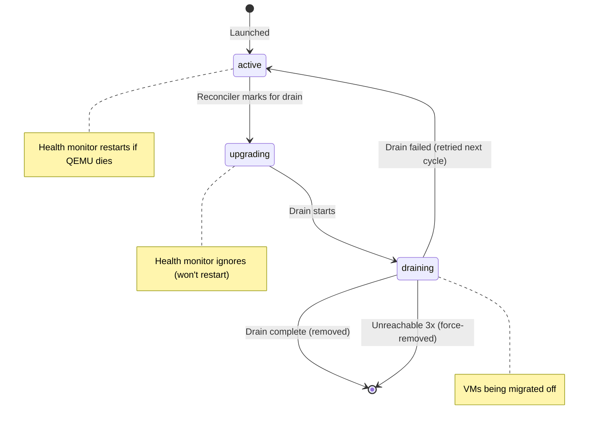
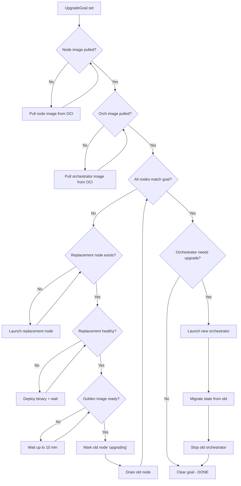
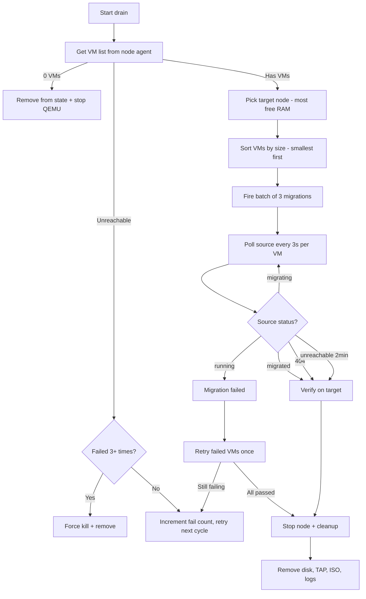
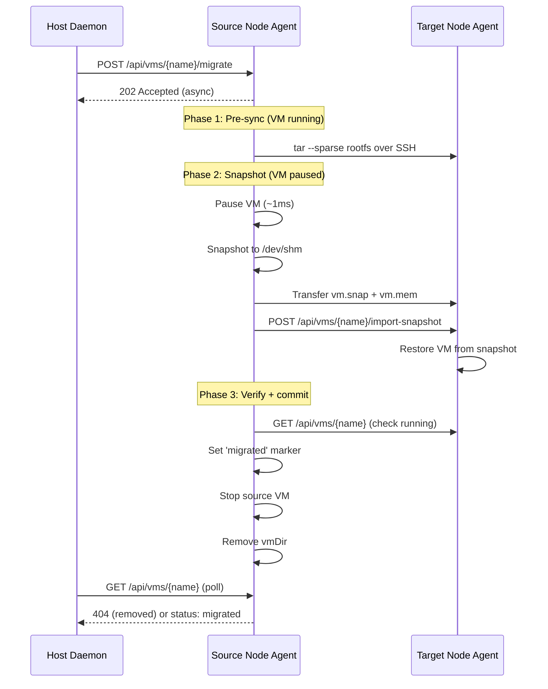
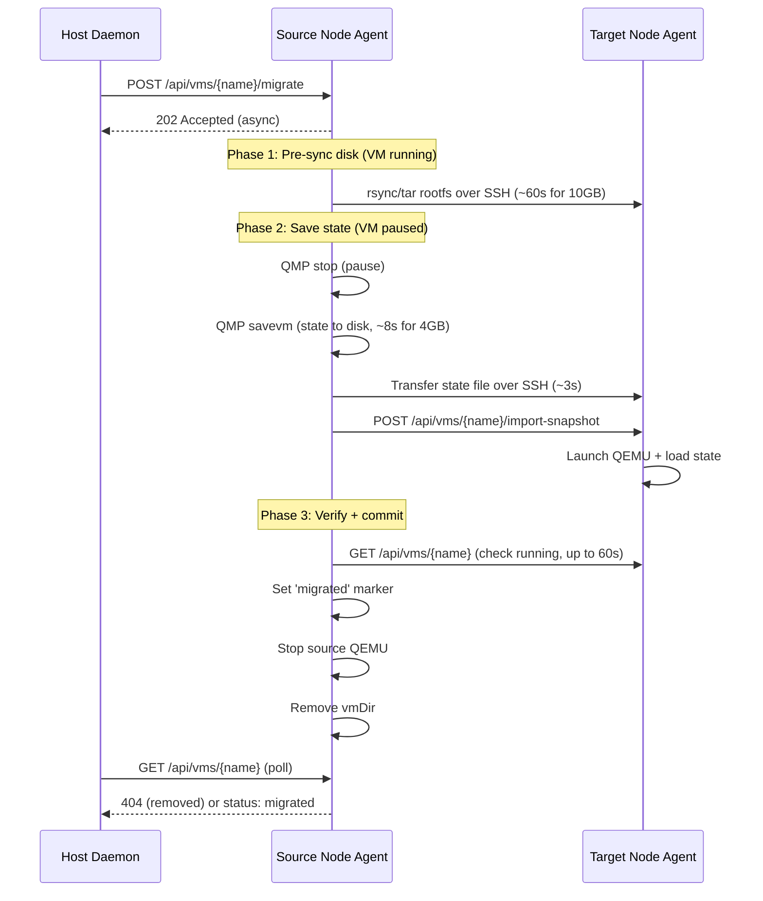
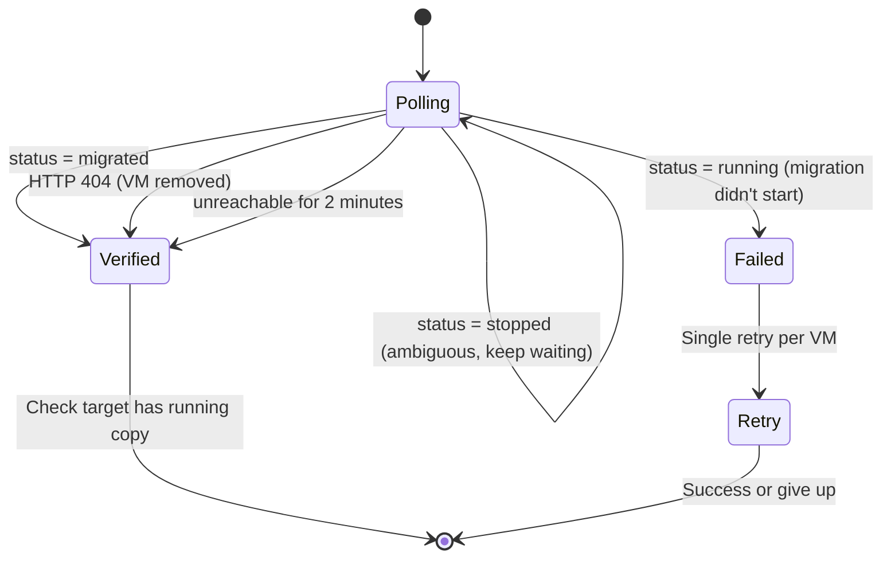
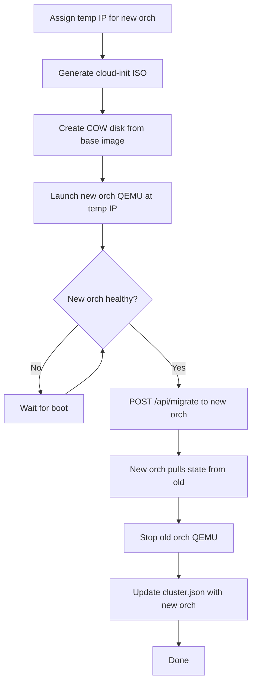

# Rolling Upgrade & Migration

This document describes how boxcutter performs zero-downtime rolling upgrades of node VMs and the orchestrator, including VM migration during node drain.

## Overview

Rolling upgrades use a **reconciliation loop** (Kubernetes controller pattern). An `UpgradeGoal` in `cluster.json` declares the desired image version. The reconciler observes reality and takes one convergence step per iteration until all VMs match the goal.

**Crash recovery is free**: on daemon restart, if `UpgradeGoal` exists, the reconciler resumes from wherever it left off by re-observing cluster state.

## Node Lifecycle

## Upgrade State Machine

## Drain Process

Drain migrates all VMs off a node, then stops and removes it.

## VM Migration

### Firecracker (snapshot/restore)

### QEMU (state save/restore)

## Drain Poll Status Machine

The host daemon polls the source node every 3 seconds during drain:

## Orchestrator Upgrade

Blue-green deployment with live state migration:

## Key Timeouts

| Component | Timeout | Purpose |
|-----------|---------|---------|
| Migration HTTP POST | 30s | Fire migration request |
| Status poll | 5s per request, 3s interval | Check VM status |
| Inactivity | 2 minutes | Assume migrated if source unreachable |
| Migration retry | 3 minutes per VM | Second attempt for failed VMs |
| Golden image build | 10 minutes | Wait for Docker build + ext4 conversion |
| Orchestrator stop | 60 seconds | Wait for old orch to finish migration |
| Drain failure limit | 3 attempts | Force-remove unreachable nodes |

## Failure Recovery

| Scenario | Behavior |
|----------|----------|
| Daemon crashes mid-upgrade | Restarts, sees UpgradeGoal in cluster.json, resumes |
| Node dies during drain | After 3 unreachable drain attempts, force-removed |
| Migration fails | Retried once; if still failing, drain aborted and retried next cycle |
| Golden image stuck | 10-minute timeout, then error (upgrade pauses, retries in 30s) |
| Target node dies mid-migration | Source VM stays running (rollback), migration retried |
| Orchestrator migration fails | Error logged, retried next reconcile cycle |

## State Persistence

All state is in `/var/lib/boxcutter/cluster.json`, written atomically (write → fsync → rename). The reconciler can crash at any point and resume correctly by re-reading the file.

Key fields:
- `nodes[].status`: "active", "upgrading", "draining"
- `nodes[].image_digest`: OCI manifest digest (immutable comparison)
- `nodes[].drain_fail_count`: tracks repeated drain failures
- `upgrade_goal`: declarative target state (cleared when complete)
- `upgrade_goal.node_image.digest`: target image digest for comparison
